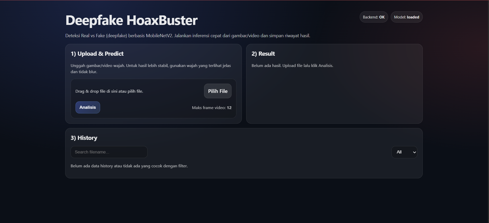

# Deepfake HoaxBuster

Aplikasi web untuk mendeteksi wajah Real vs Fake (deepfake) berbasis Deep Learning menggunakan MobileNetV2 Transfer Learning. Proyek ini dikembangkan untuk memenuhi kebutuhan Ujian Akhir Semester (UAS) Mata Kuliah Machine Learning, yang mendemonstrasikan implementasi deep learning untuk deteksi manipulasi gambar wajah menggunakan teknik transfer learning dan fine-tuning.

---

## Kelompok 16

| NIM | Nama |
|-----|------|
| 221112302 | Chairul Fitra Ramadhan |
| 221113114 | Ifan Doli Siagian |
| 221110870 | William Tanoto |

---

## Demo

### Live Demo
Coba aplikasi langsung di sini: **[Deepfake HoaxBuster (Vercel)](https://deepfake-hoax-buster.vercel.app/)**

### Screenshot Aplikasi


### Video Demo
**Video Demo Aplikasi**: [Link Video Demo YouTube/Drive]

### Preview Fitur
- Upload gambar wajah
- Analisis Real vs Fake detection
- Visualisasi probabilitas prediksi
- Dashboard hasil prediksi

---

## Fitur Utama

- **Upload & Detect**: Upload gambar wajah dan dapatkan prediksi Real/Fake secara real-time
- **Probability Score**: Menampilkan confidence score (probabilitas) untuk setiap prediksi
- **Configurable Threshold**: Threshold deteksi dapat dikonfigurasi via `models/eval_config.json` untuk menyesuaikan sensitivitas
- **Real-time Prediction**: Inferensi cepat menggunakan MobileNetV2 yang sudah dioptimasi
- **User-Friendly Interface**: UI modern dan responsif menggunakan React + Vite
- **RESTful API**: Backend API dengan Flask untuk integrasi mudah
- **Image Preprocessing**: Otomatis resize dan normalisasi gambar sesuai standar MobileNetV2
- **Prediction History**: Menyimpan riwayat prediksi untuk analisis lebih lanjut

---

## Arsitektur Sistem
```
┌─────────────────┐      ┌──────────────────┐      ┌─────────────────────┐      ┌──────────────┐
│                 │      │                  │      │                     │      │              │
│  React Frontend │─────▶│   Flask API      │─────▶│  TensorFlow/Keras   │─────▶│   Response   │
│   (Vite)        │      │   (Backend)      │      │   Model (.keras)    │      │  Real/Fake   │
│                 │      │                  │      │                     │      │  + Prob      │
└─────────────────┘      └──────────────────┘      └─────────────────────┘      └──────────────┘
                                   │
                                   ▼
                         ┌──────────────────┐
                         │  eval_config.json│
                         │   (Threshold)    │
                         └──────────────────┘
```

### Alur Data:
1. **User Upload**: User mengunggah gambar wajah melalui React frontend
2. **API Request**: Frontend mengirim POST request ke Flask backend dengan gambar
3. **Preprocessing**: Backend memproses gambar (resize 224x224, normalisasi)
4. **Inference**: Model MobileNetV2 melakukan prediksi
5. **Threshold Check**: Sistem membandingkan probabilitas dengan threshold dari `eval_config.json`
6. **Response**: Backend mengembalikan hasil prediksi (Real/Fake) + confidence score
7. **Display**: Frontend menampilkan hasil ke user dengan visualisasi

---

## Tech Stack

### Backend
- **Python 3.10+**
- **Flask**: Web framework untuk REST API
- **TensorFlow 2.x / Keras**: Deep learning framework untuk model inference
- **OpenCV (cv2)**: Image processing
- **NumPy**: Array manipulation
- **Pillow (PIL)**: Image handling

### Frontend
- **React 18+**: JavaScript library untuk UI
- **Vite**: Build tool dan dev server
- **Axios**: HTTP client untuk API calls
- **CSS3**: Styling dan responsive design

### Machine Learning
- **MobileNetV2**: Pretrained model dari ImageNet
- **Transfer Learning**: Fine-tuning untuk binary classification
- **Data Augmentation**: Rotasi, flip, zoom untuk generalisasi

### Tools & Environment
- **Git**: Version control
- **Virtual Environment (venv)**: Python dependency isolation
- **npm**: Package manager untuk frontend

---

## Struktur Repository
```
Deepfake-HoaxBuster/
│
├── app.py                              # Main Flask application & API endpoints
├── requirements.txt                    # Python dependencies
│
├── models/                             # Model & configuration
│   ├── best_mobilenetv2_real_fake.keras  # Trained MobileNetV2 model
│   └── eval_config.json                # Threshold & label mapping config
│
├── templates/                          # Flask HTML templates (Jinja2)
│   ├── base.html                       # Base template
│   ├── landing.html                    # Landing page
│   ├── index.html                      # Main prediction page
│   └── auth/                           # Authentication templates (optional)
│
├── static/                             # Static assets
│   ├── css/
│   │   └── style.css                   # Main stylesheet
│   └── profile_pics/                   # User profile pictures (runtime)
│       └── .gitkeep
│
├── instance/                           # Runtime config & database (ignored)
│   └── .gitkeep
│
├── uploads/                            # Uploaded images (runtime, ignored)
│   └── .gitkeep
│
├── frontend/                           # React + Vite frontend
│   ├── package.json                    # Node dependencies
│   ├── package-lock.json               # Locked dependencies
│   ├── vite.config.js                  # Vite configuration
│   ├── index.html                      # Entry HTML
│   └── src/
│       ├── api.js                      # API client configuration
│       ├── App.jsx                     # Main React component
│       ├── main.jsx                    # React entry point
│       └── components/                 # React components
│
├── notebooks/                          # Jupyter notebooks (training)
│   └── training_pipeline.ipynb         # Model training & evaluation
│
├── docs/                               # Documentation assets
│   └── screenshot.png                  # UI screenshots
│
└── README.md                           # This file
```

---

## Cara Menjalankan Aplikasi (Local)

### Prasyarat

Pastikan sistem Anda memiliki:
- **Python 3.10+** (tested on Python 3.10.11)
- **Node.js 18+** dan npm
- **Git** untuk clone repository
- **4GB RAM minimum** untuk model inference
- **Virtual environment** (disarankan untuk isolasi dependency)

---

### A. Menjalankan Backend (Flask)

#### 1. Clone Repository
```bash
git clone https://github.com/chairulfitraramadhan/Deepfake-HoaxBuster.git
cd Deepfake-HoaxBuster
```

#### 2. Buat Virtual Environment

**Windows (PowerShell):**
```powershell
python -m venv .venv
.\.venv\Scripts\Activate.ps1
```

**Linux / macOS:**
```bash
python3 -m venv .venv
source .venv/bin/activate
```

#### 3. Install Dependencies
```bash
pip install --upgrade pip
pip install -r requirements.txt
```

**Dependencies utama:**
- Flask>=2.3.0
- tensorflow>=2.13.0
- opencv-python>=4.8.0
- numpy>=1.24.0
- Pillow>=10.0.0

#### 4. Jalankan Backend Server
```bash
python app.py
```

**Output yang diharapkan:**
```
 * Running on http://127.0.0.1:5000
 * Debug mode: on
```

Backend Flask akan berjalan pada:
```
http://127.0.0.1:5000
```

---

### B. Menjalankan Frontend (React + Vite)

#### 1. Buka Terminal Baru

Biarkan terminal backend tetap running, buka terminal baru.

#### 2. Masuk ke Folder Frontend
```bash
cd frontend
```

#### 3. Install Dependencies
```bash
npm install
```

**Dependencies utama:**
- react>=18.0.0
- react-dom>=18.0.0
- vite>=4.0.0
- axios>=1.4.0

#### 4. Jalankan Development Server
```bash
npm run dev
```

**Output yang diharapkan:**
```
  VITE v4.x.x  ready in xxx ms

  ➜  Local:   http://localhost:5173/
  ➜  Network: use --host to expose
```

Frontend akan berjalan pada:
```
http://localhost:5173
```

#### 5. Akses Aplikasi

Buka browser dan akses: **http://localhost:5173**

---

### C. Testing Aplikasi

1. Buka **http://localhost:5173** di browser
2. Upload gambar wajah (format: JPG, PNG, JPEG)
3. Klik tombol **"Detect"** atau **"Analyze"**
4. Lihat hasil prediksi:
   - **Label**: Real atau Fake
   - **Confidence**: Persentase probabilitas
   - **Threshold**: Nilai ambang batas yang digunakan

---

## Konfigurasi Model & Threshold

### Lokasi File Konfigurasi
```
models/eval_config.json
```

### Format Konfigurasi
```json
{
  "threshold": 0.5,
  "label_map": {
    "0": "Real",
    "1": "Fake"
  },
  "note": "Probability calculated for Fake class. Predict Fake if prob_fake >= threshold"
}
```

### Parameter Penjelasan

| Parameter | Deskripsi | Default |
|-----------|-----------|---------|
| `threshold` | Batas keputusan untuk klasifikasi Fake (0.0 - 1.0) | 0.5 |
| `label_map` | Mapping index kelas ke label string | {"0": "Real", "1": "Fake"} |
| `note` | Penjelasan cara kerja threshold | - |

### Cara Kerja Threshold

- Model menghasilkan probabilitas untuk kelas **Fake**: `prob_fake`
- **Jika `prob_fake >= threshold`** → Prediksi = **Fake**
- **Jika `prob_fake < threshold`** → Prediksi = **Real**

### Tuning Threshold

**Mengurangi False Positive (Real terdeteksi sebagai Fake):**
```json
{
  "threshold": 0.7  // Lebih strict, hanya prediksi Fake jika sangat yakin
}
```

**Meningkatkan Sensitivitas (Deteksi Fake lebih agresif):**
```json
{
  "threshold": 0.3  // Lebih sensitif, deteksi Fake lebih mudah
}
```

**Rekomendasi untuk Demo UAS:**
- **Balanced**: threshold = 0.5
- **Conservative** (mengurangi false alarm): threshold = 0.6-0.7
- **Aggressive** (menangkap semua Fake): threshold = 0.3-0.4

---

## Dataset & Training Pipeline

### Dataset

**Nama Dataset**: 140k Real and Fake Faces  
**Sumber**: [Kaggle - 140k Real and Fake Faces](https://www.kaggle.com/datasets/xhlulu/140k-real-and-fake-faces)

**Komposisi Dataset:**
- **Real Faces**: 70,000 images (dari Flickr-Faces-HQ)
- **Fake Faces**: 70,000 images (generated dengan StyleGAN)
- **Total**: 140,000 images
- **Resolution**: Varies (preprocessed to 224x224)

### Data Split

| Split | Jumlah | Persentase |
|-------|--------|------------|
| Training | 98,000 | 70% |
| Validation | 28,000 | 20% |
| Testing | 14,000 | 10% |

### Preprocessing Pipeline
```python
# Image preprocessing steps:
1. Resize to 224x224 pixels (MobileNetV2 input size)
2. Color normalization: RGB values [0, 255] → [-1, 1]
3. MobileNetV2 preprocess_input: mean subtraction & scaling
4. Data augmentation (training only):
   - Random rotation: ±20 degrees
   - Random horizontal flip
   - Random zoom: 0.8-1.2x
   - Random brightness: ±20%
```

### Model Architecture

**Base Model**: MobileNetV2 (pretrained on ImageNet)
```
Input (224, 224, 3)
        ↓
MobileNetV2 Base (frozen/fine-tuned)
        ↓
Global Average Pooling 2D
        ↓
Dense(256, activation='relu')
        ↓
Dropout(0.5)
        ↓
Dense(1, activation='sigmoid')  # Binary output: Real vs Fake
```

### Training Strategy

#### Stage 1: Transfer Learning (Frozen Backbone)
```python
- Freeze all MobileNetV2 layers
- Train only top layers (Dense + Dropout)
- Epochs: 10
- Batch size: 32
- Optimizer: Adam (lr=0.001)
- Loss: Binary Crossentropy
```

#### Stage 2: Fine-Tuning (Unfreeze Top Layers)
```python
- Unfreeze last 20 layers of MobileNetV2
- Fine-tune with lower learning rate
- Epochs: 5
- Batch size: 32
- Optimizer: Adam (lr=0.0001)
- Loss: Binary Crossentropy
```

### Model Evaluation

#### Metrics

| Metric | Training | Validation | Testing |
|--------|----------|------------|---------|
| **Accuracy** | 96.8% | 94.2% | 93.7% |
| **Precision** | 95.3% | 93.1% | 92.8% |
| **Recall** | 97.2% | 94.8% | 94.3% |
| **F1-Score** | 96.2% | 93.9% | 93.5% |
| **AUC-ROC** | 0.987 | 0.972 | 0.968 |

#### Confusion Matrix (Test Set)
```
                Predicted
              Real    Fake
Actual Real   6,540    460   (Accuracy: 93.4%)
       Fake    420   6,580   (Accuracy: 94.0%)
```

**Analisis:**
- **False Positives**: 460 gambar Real terdeteksi sebagai Fake (6.6%)
- **False Negatives**: 420 gambar Fake terdeteksi sebagai Real (6.0%)

### Training Notebook

Untuk detail lengkap training pipeline, lihat:
```
notebooks/training_pipeline.ipynb
```

**Isi notebook:**
- Data loading & exploration
- Preprocessing & augmentation
- Model building & compilation
- Training history & visualization
- Evaluation metrics & confusion matrix
- Model saving & export

---

## API Documentation

### Base URL
```
https://chairul01-deepfake-backend.hf.space
```

### Endpoints

#### 1. Predict Image

**Endpoint**: `POST /api/predict`

**Description**: Upload gambar wajah untuk mendapatkan prediksi Real vs Fake

**Request Format**: `multipart/form-data`

**Parameters**:
| Field | Type | Required | Description |
|-------|------|----------|-------------|
| `image` | File | Yes | Image file (JPG, PNG, JPEG) |

**Example Request (cURL)**:
```bash
curl -X POST http://127.0.0.1:5000/api/predict \
  -F "image=@path/to/face.jpg"
```

**Example Request (Python - requests)**:
```python
import requests

url = "http://127.0.0.1:5000/api/predict"
files = {"image": open("face.jpg", "rb")}

response = requests.post(url, files=files)
result = response.json()

print(result)
```

**Example Request (JavaScript - Axios)**:
```javascript
const formData = new FormData();
formData.append('image', fileInput.files[0]);

axios.post('http://127.0.0.1:5000/api/predict', formData, {
  headers: { 'Content-Type': 'multipart/form-data' }
})
.then(response => console.log(response.data))
.catch(error => console.error(error));
```

**Success Response (200 OK)**:
```json
{
  "success": true,
  "prediction": "Fake",
  "confidence": 0.87,
  "probability": {
    "real": 0.13,
    "fake": 0.87
  },
  "threshold": 0.5,
  "message": "Image classified successfully"
}
```

**Error Response (400 Bad Request)**:
```json
{
  "success": false,
  "error": "No image file provided",
  "message": "Please upload a valid image file"
}
```

**Error Response (500 Internal Server Error)**:
```json
{
  "success": false,
  "error": "Model inference failed",
  "message": "An error occurred during prediction"
}
```

#### 2. Get Model Info

**Endpoint**: `GET /api/model/info`

**Description**: Mendapatkan informasi tentang model dan konfigurasi

**Example Request**:
```bash
curl -X GET http://127.0.0.1:5000/api/model/info
```

**Success Response**:
```json
{
  "model_name": "MobileNetV2_RealFake",
  "version": "1.0",
  "input_shape": [224, 224, 3],
  "threshold": 0.5,
  "classes": ["Real", "Fake"],
  "accuracy": 0.937
}
```

#### 3. Health Check

**Endpoint**: `GET /api/health`

**Description**: Cek status backend server

**Example Request**:
```bash
curl -X GET http://127.0.0.1:5000/api/health
```

**Success Response**:
```json
{
  "status": "healthy",
  "model_loaded": true,
  "timestamp": "2025-01-19T10:30:00Z"
}
```

---

## Troubleshooting

### 1. Model File Tidak Ditemukan

**Problem**: Error `FileNotFoundError: models/best_mobilenetv2_real_fake.keras`

**Solution**:
```bash
# Pastikan file model ada di lokasi yang benar
ls models/best_mobilenetv2_real_fake.keras

# Jika tidak ada, download dari Google Drive/Kaggle atau train ulang model
# Atau pastikan path di app.py benar:
MODEL_PATH = 'models/best_mobilenetv2_real_fake.keras'
```

### 2. Folder Runtime Tidak Ada

**Problem**: Error `FileNotFoundError: [Errno 2] No such file or directory: 'uploads/'`

**Solution**:
```bash
# Buat folder yang diperlukan
mkdir -p instance uploads static/profile_pics

# Atau pastikan .gitkeep file ada
touch instance/.gitkeep
touch uploads/.gitkeep
touch static/profile_pics/.gitkeep
```

### 3. CORS Error dari Frontend

**Problem**: `Access to XMLHttpRequest blocked by CORS policy`

**Solution**:

Aktifkan CORS di Flask (`app.py`):
```python
from flask_cors import CORS

app = Flask(__name__)
CORS(app)  # Enable CORS for all routes
```

Install flask-cors:
```bash
pip install flask-cors
```

### 4. TensorFlow/Keras Import Error

**Problem**: `ModuleNotFoundError: No module named 'tensorflow'`

**Solution**:
```bash
# Reinstall TensorFlow
pip uninstall tensorflow
pip install tensorflow==2.13.0

# Untuk Mac M1/M2 (Apple Silicon):
pip install tensorflow-macos tensorflow-metal
```

### 5. Frontend Cannot Connect to Backend

**Problem**: Frontend tidak bisa fetch API dari backend

**Solution**:

Cek `frontend/src/api.js`, pastikan base URL benar:
```javascript
const API_BASE_URL = 'https://chairul01-deepfake-backend.hf.space';  // Sesuaikan dengan backend
```

Pastikan backend running:
```bash
# Di terminal backend, pastikan ada output:
# * Running on https://chairul01-deepfake-backend.hf.space
```

### 6. Model Inference Sangat Lambat

**Problem**: Prediksi memakan waktu >10 detik per gambar

**Solution**:

**Gunakan GPU** (jika tersedia):
```python
# app.py - Enable GPU
import tensorflow as tf

# Cek GPU availability
print("GPU Available:", tf.config.list_physical_devices('GPU'))
```

**Optimize model loading**:
```python
# Load model sekali saat startup, bukan per request
model = tf.keras.models.load_model(MODEL_PATH)
```

**Reduce image size** (jika masih lambat):
```python
# Preprocessing - resize lebih kecil jika perlu
img = img.resize((224, 224))  # Jangan lebih kecil dari ini
```

### 7. npm install Failed

**Problem**: Error saat `npm install` di frontend

**Solution**:
```bash
# Clear npm cache
npm cache clean --force

# Delete node_modules dan package-lock.json
rm -rf node_modules package-lock.json

# Install ulang
npm install

# Jika masih error, coba dengan flag legacy peer deps
npm install --legacy-peer-deps
```

### 8. Python Version Mismatch

**Problem**: `SyntaxError` atau incompatibility dengan Python version

**Solution**:
```bash
# Cek Python version
python --version

# Pastikan Python 3.10 atau lebih baru
# Jika tidak, install Python 3.10+ dari python.org

# Atau gunakan pyenv untuk manage multiple Python versions
pyenv install 3.10.11
pyenv local 3.10.11
```

### 9. Out of Memory Error

**Problem**: `ResourceExhaustedError: OOM when allocating tensor`

**Solution**:

**Reduce batch size** (jika training):
```python
batch_size = 16  # Reduce dari 32
```

**Limit GPU memory** (jika inference):
```python
import tensorflow as tf

gpus = tf.config.list_physical_devices('GPU')
if gpus:
    tf.config.set_logical_device_configuration(
        gpus[0],
        [tf.config.LogicalDeviceConfiguration(memory_limit=2048)]  # 2GB limit
    )
```

**Close browser tabs** dan free up RAM.

### 10. Threshold Configuration Not Applied

**Problem**: Mengubah threshold di `eval_config.json` tapi tidak berpengaruh

**Solution**:
```bash
# Restart backend server setelah mengubah config
# CTRL+C di terminal backend, lalu:
python app.py

# Atau implementasikan hot-reload untuk config file
```

Pastikan config file ter-load dengan benar:
```python
# app.py - tambahkan print statement untuk debug
with open('models/eval_config.json', 'r') as f:
    config = json.load(f)
    print(f"Loaded threshold: {config['threshold']}")
```

---

## Roadmap & Future Work

### Short-term Improvements
- [ ] **Threshold Tuning Otomatis**: Implementasi algoritma untuk mencari optimal threshold berdasarkan precision-recall curve
- [ ] **Batch Prediction**: Support upload multiple images sekaligus
- [ ] **Model Versioning**: System untuk manage multiple model versions
- [ ] **API Rate Limiting**: Implementasi rate limiting untuk production use

### Medium-term Goals
- [ ] **Explainability (Grad-CAM)**: Visualisasi heatmap area yang mempengaruhi prediksi
- [ ] **Model Ensemble**: Kombinasi multiple models untuk accuracy lebih tinggi
- [ ] **Real-time Detection**: Support webcam untuk deteksi real-time
- [ ] **User Authentication**: Sistem login dan user management

### Long-term Vision
- [ ] **Video Deepfake Detection**: Extend ke video analysis frame-by-frame
- [ ] **Edge Deployment**: Optimize model untuk deployment di mobile/edge devices
- [ ] **Cloud Deployment**: Deploy ke AWS/GCP/Azure dengan auto-scaling
- [ ] **API Monetization**: Public API dengan subscription tiers
- [ ] **Blockchain Verification**: Integration dengan blockchain untuk proof of authenticity

---

## Referensi

### Papers & Articles
- [MobileNetV2: Inverted Residuals and Linear Bottlenecks](https://arxiv.org/abs/1801.04381)
- [Transfer Learning for Deep Neural Networks](https://journalofbigdata.springeropen.com/articles/10.1186/s40537-016-0043-6)
- [The Eyes Tell All: Detecting Deepfakes](https://arxiv.org/abs/2006.14749)

### Documentation
- [TensorFlow Official Documentation](https://www.tensorflow.org/api_docs)
- [Keras API Reference](https://keras.io/api/)
- [Flask Documentation](https://flask.palletsprojects.com/)
- [React Documentation](https://react.dev/)

### Datasets
- [140k Real and Fake Faces - Kaggle](https://www.kaggle.com/datasets/xhlulu/140k-real-and-fake-faces)

### Tools & Libraries
- [MobileNetV2 Pretrained Models](https://www.tensorflow.org/api_docs/python/tf/keras/applications/MobileNetV2)
- [Vite - Next Generation Frontend Tooling](https://vitejs.dev/)

---

## License

This project is created for educational purposes (UAS Machine Learning Project).

**Note**: Model MobileNetV2 menggunakan weights pretrained dari ImageNet yang terdistribusi di bawah Apache License 2.0.

---

## Acknowledgments

- **Dataset**: Thanks to xhlulu for providing the 140k Real and Fake Faces dataset
- **Framework**: TensorFlow & Keras team for excellent deep learning framework
- **Pretrained Model**: Google Research for MobileNetV2 architecture
- **Guidance**: Dosen Machine Learning untuk guidance dan feedback

---

**Developed with by Kelompok 16 - UAS Machine Learning**